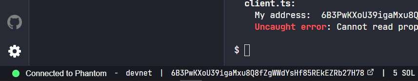
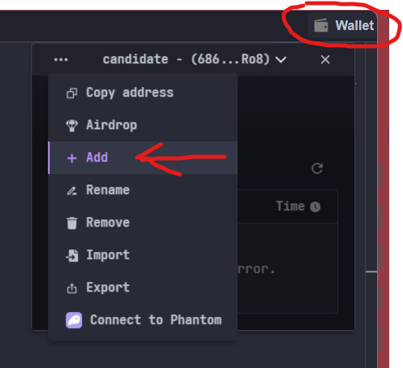
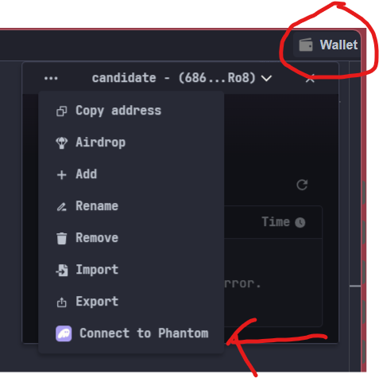
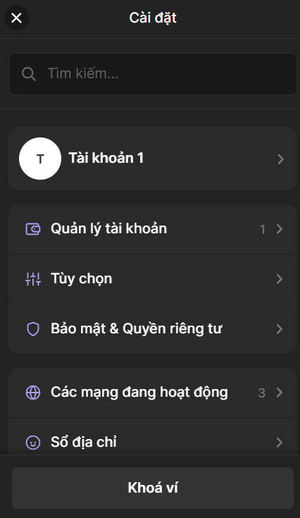

# How to use
## Create new wallet

There are 2 way to create new wallet

First you need to visit solana playground: [beta.solpg.io](https://beta.solpg.io/)

Then select connect to devnet on bottom left of website


Then you can create an account direct on top right menu


Another way is better but not recommend for noob, you need to download Phantom extension and sign up an account. Then you can create many wallet as you want, but to use this wallet in devnet solana, you need to first connect in solana playground


## How to start server API

First of all you need python > 3.10 and pip

### Windows
```
./install.bat
./run.bat
```

### Linux
```
cd blockchain\client

python -m venv venv
venv\Scripts\activate

pip install -r requirements.txt

python main.py
```

### Document API

When server start at port 8000 then visit [http://localhost:8000/docs](http://localhost:8000/docs) for document of API

## Account are using for fee payer

you can change fee payer in `blockchain\client\config.py`

## How to get private key of wallet

For solana wallet you can get private key by get keypair from export function on top right menu then using convert pair function on docs api of server to get private key of account

For Phantom wallet is must easier, just go to setting on extension then click to account you want to get private key, then take the private key



## How to check on chain

For check account info you can see at `https://explorer.solana.com/address/{public_address}?cluster=devnet`

For check Instruction info you can see at `https://explorer.solana.com/tx/{public_address}?cluster=devnet`

For example:
- [https://explorer.solana.com/address/CqNsnnTNyCsoVrTtNdiFZegK2eJSARXrXwvyzYGBcYi2?cluster=devnet](https://explorer.solana.com/address/CqNsnnTNyCsoVrTtNdiFZegK2eJSARXrXwvyzYGBcYi2?cluster=devnet)
- [https://explorer.solana.com/tx/2zeiZyYjhbriiGcfPNXz8YTt4qtB3X7BqE1zocxrLwpTGRgHTuqBuFb4dW2ZXNq467ptM5xWNWJTfaEv3GxwQV5J?cluster=devnet](https://explorer.solana.com/tx/2zeiZyYjhbriiGcfPNXz8YTt4qtB3X7BqE1zocxrLwpTGRgHTuqBuFb4dW2ZXNq467ptM5xWNWJTfaEv3GxwQV5J?cluster=devnet)